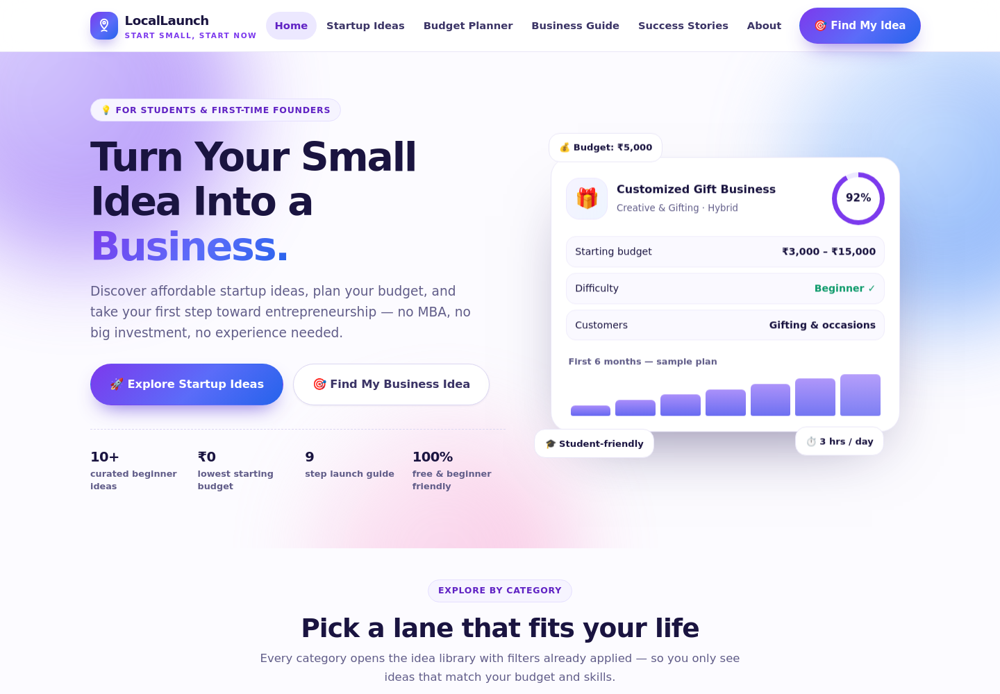
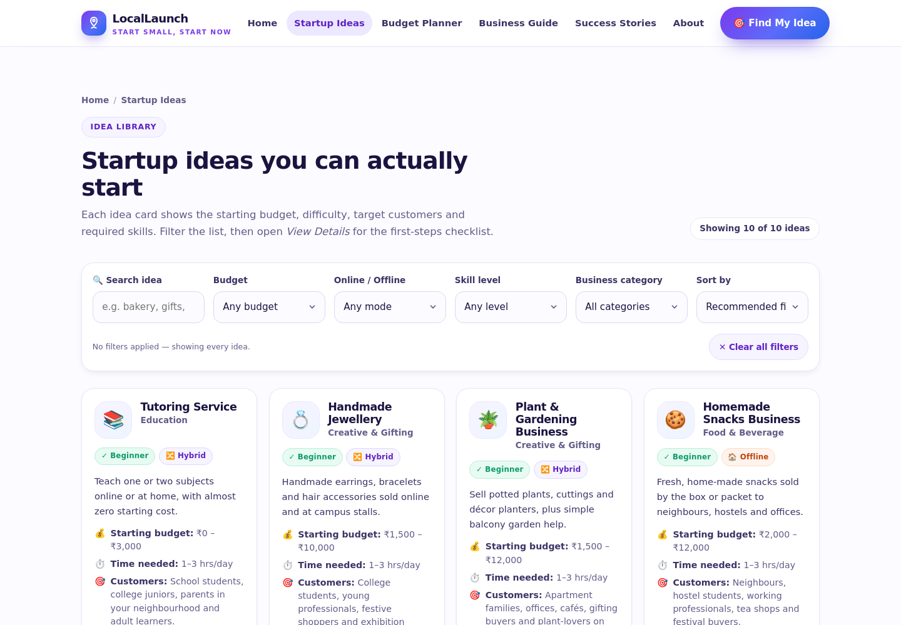
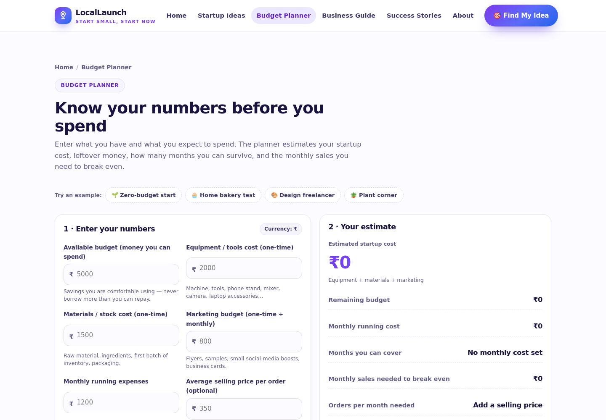
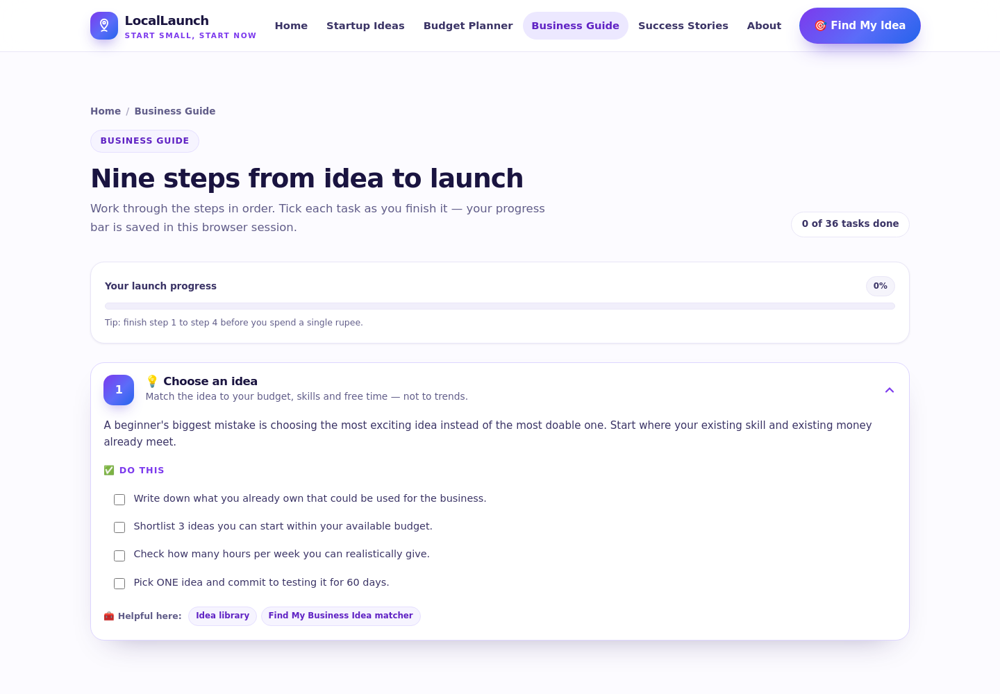

# 🚀 LocalLaunch

**Turn Your Small Idea Into a Business.**

LocalLaunch is a free, beginner-friendly website that helps students and aspiring entrepreneurs
discover affordable startup ideas, plan a realistic budget, and take the first step toward
entrepreneurship — no MBA, no big investment, no experience required.

> 🎓 Built as a college startup / project submission. All business ideas, costs and stories are
> **sample data for learning** — nothing here is financial advice or an income claim.

---

## ✨ What it does

| Feature | Description |
| --- | --- |
| 💡 **Idea library** | 10 curated startup ideas with starting budget, difficulty, target customers and required skills |
| 🔍 **Working filters** | Filter by budget, online/offline mode, skill level and business category + search and 4 sort modes |
| 🎯 **Find My Business Idea** | A 5-question matcher that scores every idea out of 100 and explains *why* each match fits |
| 🧮 **Budget Planner** | Live calculator for startup cost, leftover budget, monthly runway, break-even sales and orders needed |
| 📚 **Business Guide** | 9 expandable steps with a 36-task checklist and saved progress bar |
| 🌱 **Success Stories** | 6 clearly-labelled fictional examples showing investment, challenges and lessons learned |
| ❓ **FAQ + About** | Straight answers about what the platform does and does not do |

## 🎨 Design

- White / light-purple / blue palette with soft accent colours
- Fully responsive: mobile, tablet and desktop layouts
- Reusable card, badge, chip and step components
- Subtle animations: floating hero art, scroll reveals, hover lifts, animated counters, matching progress bars
- Accessibility-minded: semantic landmarks, labelled inputs, `aria-expanded` accordions, focus-visible rings and a `prefers-reduced-motion` fallback

## 🛠️ Built with

- **HTML5** — one file, semantic structure
- **CSS3** — design tokens (custom properties), flexbox + CSS grid, keyframe animations, no framework
- **Vanilla JavaScript** — hash-based routing, reusable render functions, `localStorage` for guide progress
- **Zero runtime dependencies** — no build step, no CDN, works offline

## ▶️ Run it locally

Just open the file:

```bash
open index.html        # macOS
start index.html       # Windows
xdg-open index.html    # Linux
```

Or serve it:

```bash
python3 -m http.server 8000
# then visit http://localhost:8000
```

## 🧪 Tests

A jsdom smoke test covers the idea library, all filters and sorts, the budget calculations,
the guide checklist, the matcher flow, routing, modals and accessibility basics.

```bash
npm install
npm test
```

```
SUMMARY: 69/69 passed
```

## 📁 Project structure

```
.
├── index.html            # the entire website (HTML + CSS + JS)
├── tests/
│   ├── smoke-test.js     # jsdom functional test suite (69 checks)
│   └── shot.js           # Playwright script that captures screenshots
├── shots/                # screenshots used in this README
└── README.md
```

## 🖼️ Screenshots

| Home | Startup Ideas |
| --- | --- |
|  |  |

| Budget Planner | Business Guide |
| --- | --- |
|  |  |

## 🔐 Privacy

There is no backend, no accounts and no analytics. Quiz answers, planner numbers and guide
progress stay in your browser's local storage and are never uploaded anywhere.

## ⚠️ Disclaimer

All ideas, budget ranges, difficulty ratings and success stories on this site are **illustrative
sample data** created for a student project. The entrepreneurs in Success Stories are fictional
characters. LocalLaunch does not provide financial, legal or tax advice, and makes no promise of
income or business success. Always verify local rules and real supplier prices before spending money.

---

© LocalLaunch — made for a college startup project demo.
